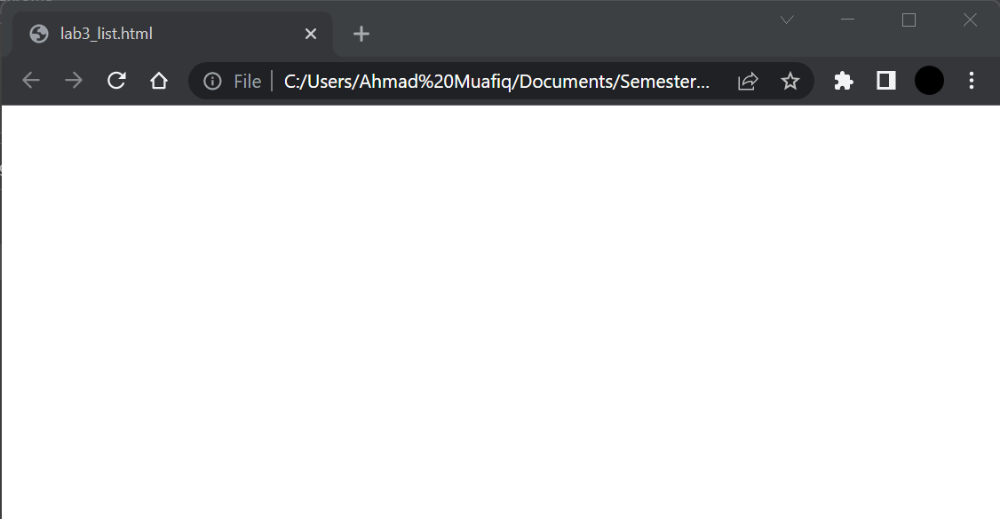
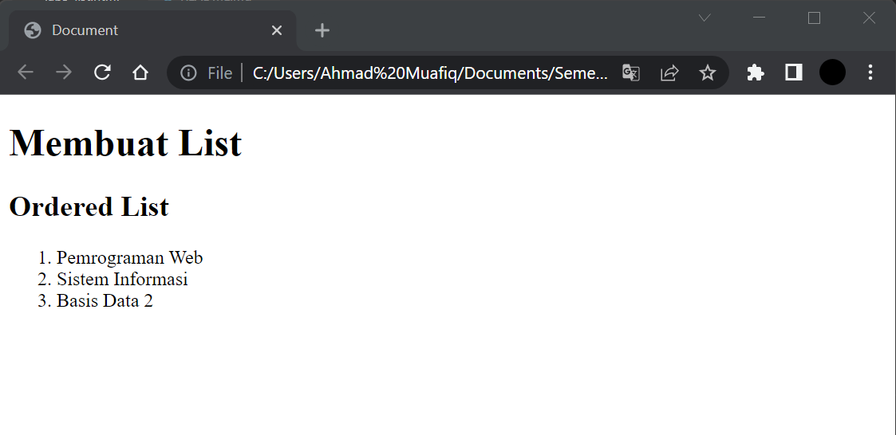

# Lab3Web
## Tugas Pemograman Web - pertemuan 4 Praktikum 2

Nama  : Ahmad Muafiq 
NIM   : 312010152 
Kelas : TI.20.B.1 

1. Membuat dokumen HTML
*Untuk langkah awal kita membuat dokumen HTML terlebih dahulu. Berikut tampilannya* 

2. Kemudian langkah selanjutnya menambahkan kode untuk membuat Ordered List.

