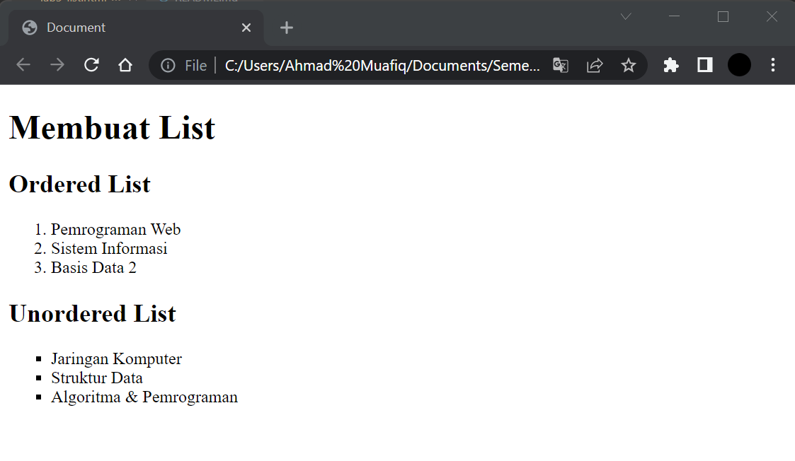
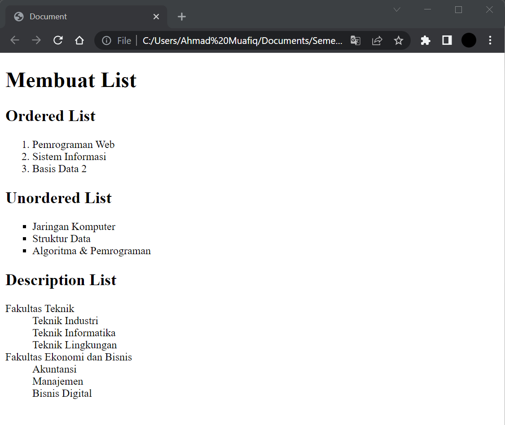
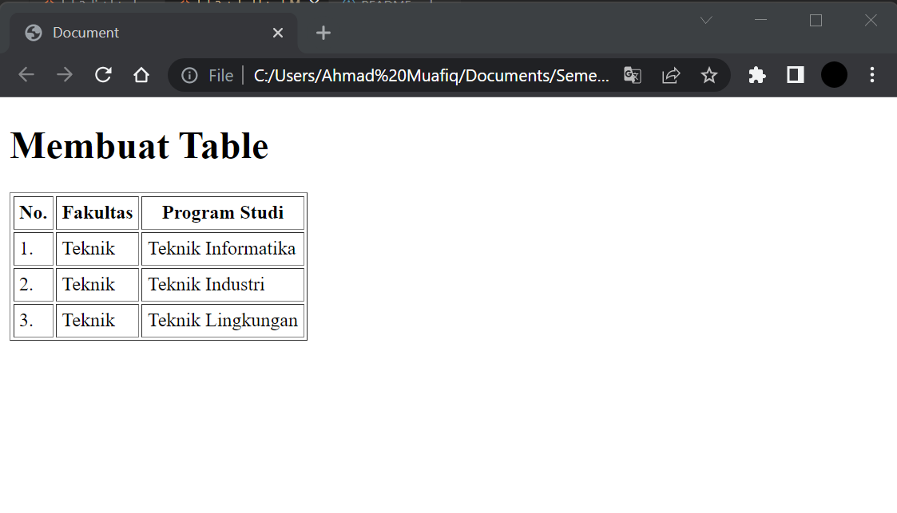
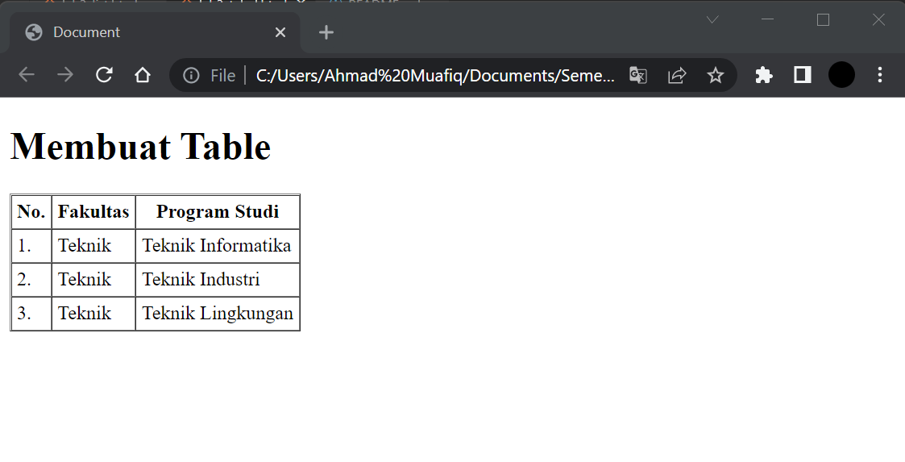
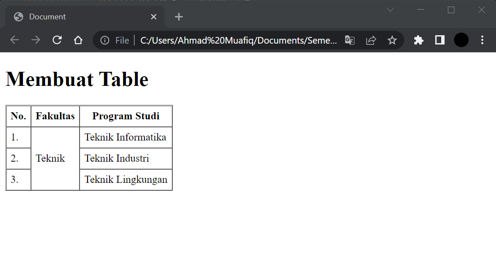
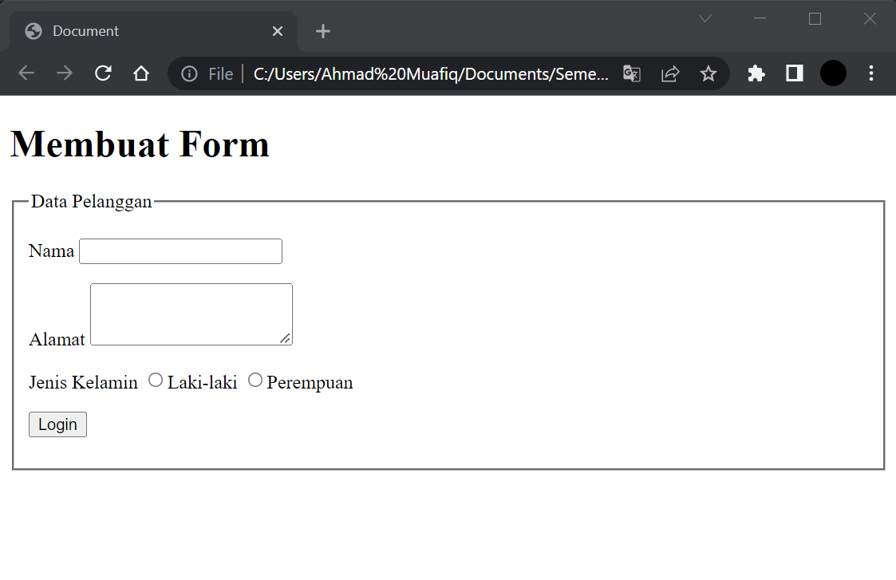

# Lab3Web
## Tugas Pemograman Web - pertemuan 4 Praktikum 2

Nama  : Ahmad Muafiq 
NIM   : 312010152 
Kelas : TI.20.B.1 

1. Membuat dokumen HTML

*Untuk langkah awal kita membuat dokumen HTML terlebih dahulu. Berikut tampilannya* 

2. Membuat Ordered List.

*Untuk mebuat ordered list kita menggunakan misal angka atau huruf dan lainnnya, Berikut tampilanyanya.*

3. Membuat Unordered List.

*Untuk mebuat Unodered list kita menggunakan misal titik kotak atau bulat kecil dan lainnnya, Berikut tampilanyanya.*

4. Membuat description list.

*Kemudian membuat deklarasi list tanpa tanda didepannya, berikut tampiilanya*

5. Membuat Tabel.

*Berikut adalah contoh membuat list di dalam tabel, berikut tampilanya*

6. Mengatur Margin dan Padding.

*Berikut tampilanya*

7. Menggabungkan sel data.

*Untuk menggabungkan sel data, gunakan atribut rowspan dan colspan. Atribut rowspan untuk menggabungkan baris (secara vertikal) dan colspan untuk menggabungkan kolom, secara horizontal. Berikut tampilanya*

8. Membuat Form.

*selanjutnya ditahap ini saya akan membuat form, berikut tampilanya*

